# BAMAZON
april 12, 2018 - a mysql + command-line app that keeps track of item inventory and allows customers to purchase items

### apocalypse: the beginning

"There's someone at the door." She stands on her tiptoes, peering out the peephole.

"Who is it?"

"Just a zombie."

"Where's our stuff?"

She points to the closet.

I fling open the closet door dramatically, only to find a load of nothing. "Crap. Hang on." I dig around in my pocket and whip out my laptop.

She flops back onto the couch and scrolls through her phone. "Don't forget the toilet paper."

"Yeah, I won't."

### calling for bamazon: the flashback

I type in my credentials, connect to the MySQL server, and open the command line. I scroll through the inventory, hoping that whatever we need is available.

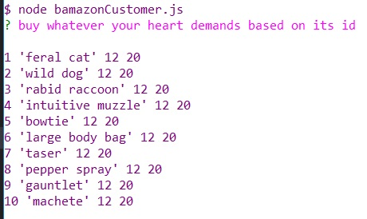

Ahh, perfect timing! They've restocked everything. The layout could use some improvement, but let's think of it as a way to confuse casual grocery shoppers. I remember when I first learned to use it.

"Ew, I'm allergic to numbers."

She punches me lightly on the arm. "I don't see you breaking out every time you look at money."

"True."

"So, this very first number is the `item_id`. Instead of wasting time typing in the `product_name`, you just type a number. The second number we see is the product's `price`. That's 12... something. Gold? Dollars? Cents? Arms and legs? I'm not sure."

"Yeah, arms and legs sounds likely."

"I hope they're from zombies and not us." She points to the last number. "And that number is the `stock_quantity`. It always starts at 20. It can never go below 1. Once it reaches 1, we need to wait for BAMAZON to stop being lazy and restock their database."

"So they would gladly let us die from a zombie bite while we're waiting for... uh... bowties to restock."

"Yep. But they're the only business left now, so we kind of _have_ to depend on them."

"Or we could just move."

"Yeah, to like Saturn. Okay, now let's make an order. I wish they sold custard buns."

### stocking up: the present

I start ordering items from BAMAZON after making sure I'm connected to the database. My stomach growls. I wish BAMAZON sold custard buns, too.

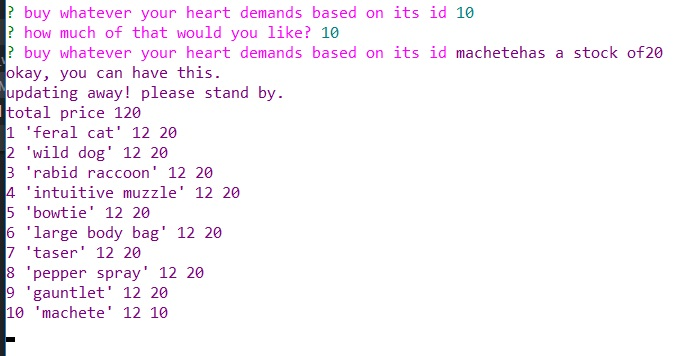

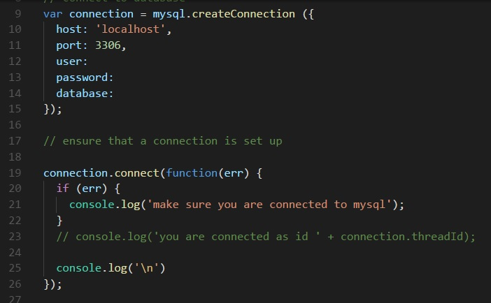

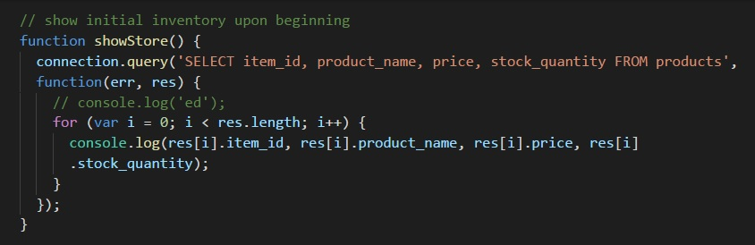

I order 10 machetes using its `item_id` of 10. We're now 10 machetes up and 120 arms and legs down. I cringe at the poor grammar but continue to place our order. The `bamazon` database and our `totalPrice` continue to update by making queries to MySQL, which is how I know how much of something is in stock.

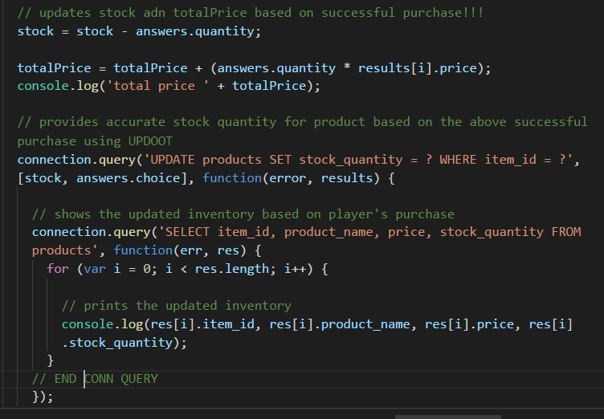

I look at the list again. I don't dare tell her that they don't have toilet paper or custard buns. I sigh.

"What's up?"

"The sky."

"We might need to order a few more punchlines."

"Wit cannot be purchased - only earned through hard work and dedication." I continue to order.

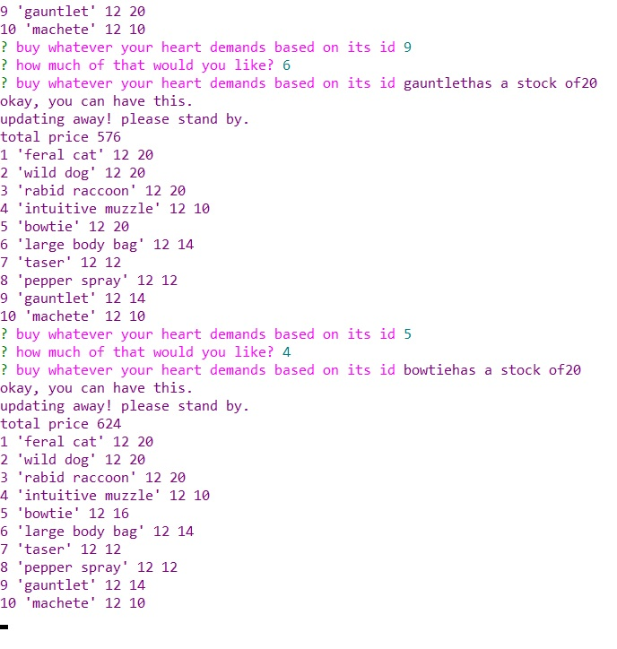

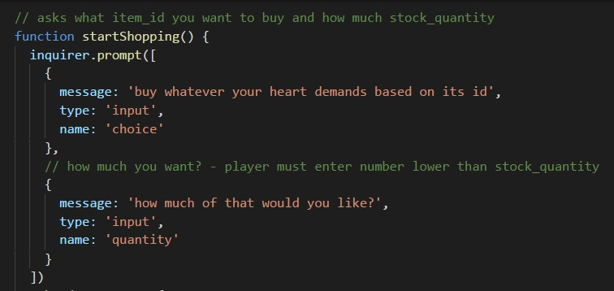

624 arms and legs for 10 muzzles, 4 bowties, 6 body bags, 8 tasers, 8 pepper sprays, 6 gauntlets, and the original 10 machetes. I frown. What kind of medieval werewolf hunt date was this? I tap my fingers against my chin, looking at the top three choices.

"What do you want?"

"I kind of want to buy some animals."

### misnomers

The animals are an assortment of kindly, hot-headed, and just plain crazy. That's when intuitive muzzles come in handy - they expand and contract based on their target's snout. They usually work for animals and not so much zombies.

We like to keep the kindly animals around. The hot-headed ones will patrol the area. The crazy ones, with the right amount of training, will rush into battle and kill a few zombies for us.

For some reason, the animals have no problem eating zombie remains. They're not affected by whatever virus or bacteria that lurks through those half-dead organs.

I still don't know why we keep ordering bowties. Maybe it's recursion or something.

### welcome the menagerie

Okay, I did it. I wanted furry friends, so furry friends I'll get. 8 cats, 6 dogs, 2 raccoons, and another step towards animal army.

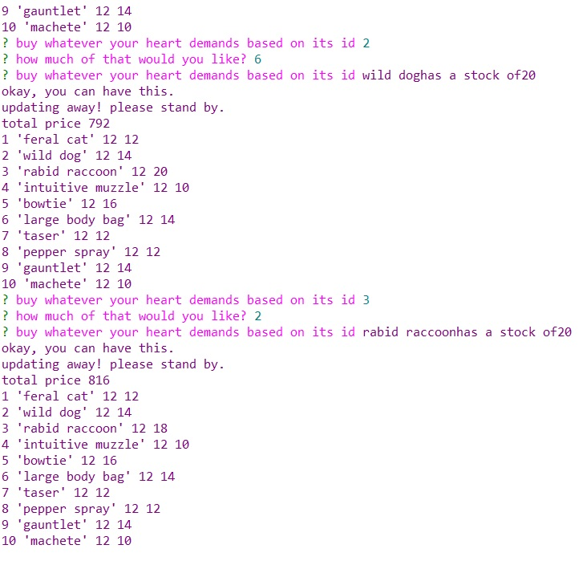

I stare at the trapdoor under the table. In a day or two, our shipment will arrive through that door, facilitated by the underground tunnels, and we'll be hunting zombies once again. It's a pretty good way to earn a living, but maybe in a few months we'll pack up and move somewhere where there's no one to bother us in the middle of the night and demand that we listen to the words of their zombie overlord and savior.

I'm just about to leave the program when I remember one more thing. I grin and crack my knuckles, then type in a few more codes to enter the official database.

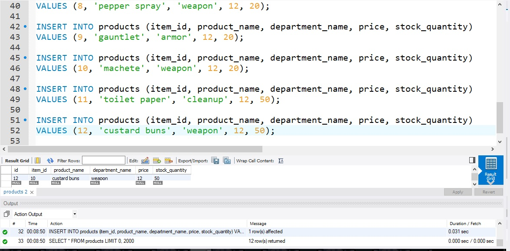

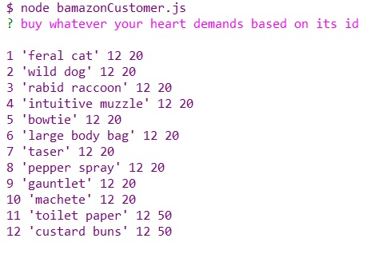

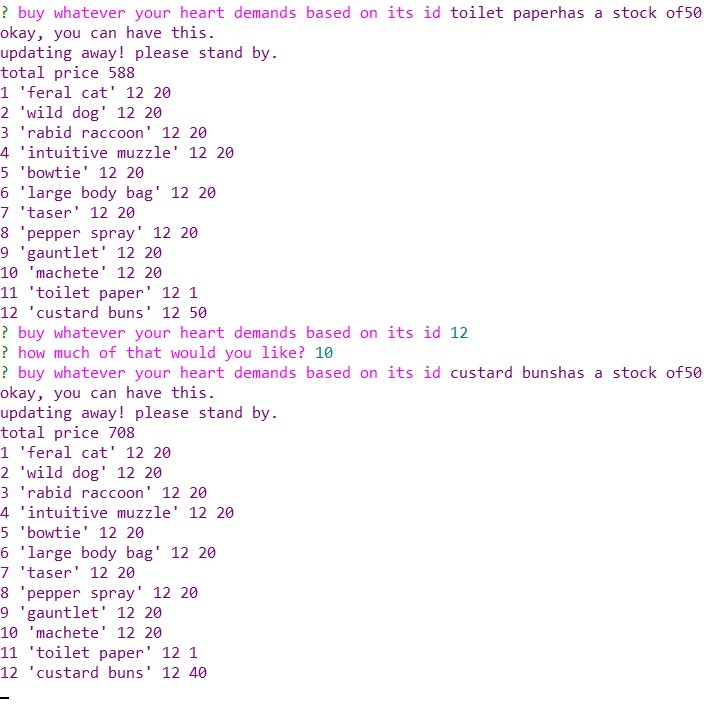

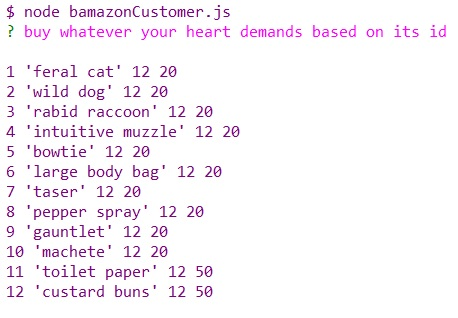

Every item back in order, along with two new essentials. I exit the database and the program, then close my laptop.

"All done?"

"Yep."

"...Why are you smiling?"

"You'll see."